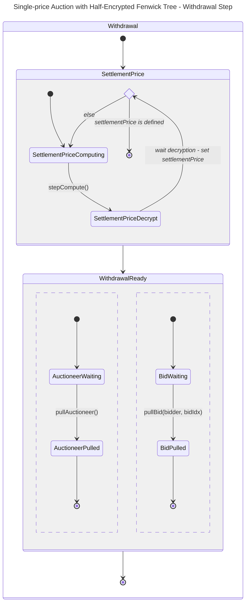

# Design considerations

## The Single-Price Auction (SPA) mechanism

A Single-Price Auction (SPA) is an auction scheme that exchanges a specified amount of token (referred to as the
_auction token_ with its corresponding _auction token supply_) for a _base token_. All participants submit _private
price/quantity pairs_ for the auctioned tokens. The auction is resolved by distributing the auctioned tokens to the
participants, by decreasing price and within the limits of the auction supply. The final price is known as the
_settlement price_, and is the price of the bid at which the last distributed token is related to.

### Feature Set

The goal of the bounty program is to challenge the feasibility of such an auction scheme with private data sets. For
this purpose, I've chose these features to be part of what we will consider an acceptable SPA system:

- **Safe and checked deposit** of the auctioned tokens
- **Submission of bids** with _public prices_ and encrypted quantities
- **Submission of multiple bids per address**, whether they are effectful or not.
- **Increased anonymity** with the submission of bids with **random prices and zero-quantities**, effectively performing
  encrypted no-ops indistinguishable from effectful encrypted bids.
- **Enforce bidders deposit** by requiring locked funds when submitting a bid.
- **Refunding excess deposit** both for the auctioneer and bidders.

### Ordering Bids and Compute the Settlement Price

The heart of the problem here is to implement a data structure that allows us to:

- Registering a bid and "propagate" the cumulative sum of quantities inserted so far
- Find the first bid at which the auction token supply is reached

Such a data structure is a [Fenwick tree](https://en.wikipedia.org/wiki/Fenwick_tree). It provides three base
operations: interrogation, update and search and these are all done in $O(\log n)$ complexity, which makes it a good
candidate for implementation in the EVM. It is also an implicit data structure, an interesting property that allow us
not to go through any costly initialization process. We will be using two of these operations:

- The `update` operation will be used to **insert new bids**.
- The `search` operation will be used to **compute the settlement price**.

When computing the settlement price, if the total tokens put to auction is not found in the tree, we need to fallback to
the lowest price registered. Therefore, we additionally **keep track of the lowest registered bid price** beside the
Fenwick tree when adding a bid.

### Data Types

In the context of the fhEVM, we will not be working with `ERC20`s or native ETH, but exclusively with
`ConfidentialERC20`s, to preserve privacy. `ConfidentialERC20`s uses `euint64` for storage and **6 decimal points**.
Therefore, we chose to represent **bid quantities with `euint64`s** to maintain consistency with the token
specification.

To represent **bid prices**, 6 decimal points are not effective in practice. We will chose to use **`uint64`s** but with
**12 decimal points**.

The Fenwick tree is an implicit indexed array keeping track of an ordered cumulative sum. I choose to implement this
with a **`mapping(uint16 => euint128)`**. We're using **`uint16` as a price index**, because using 64 bits would be too
costly in gas and would make the decryption process impractical. We're not using an encrypted data type, this will be
discussed in the next section.

An `uint16` can't represent all possible prices an `uint64` can represent, so a **price discretization function** is
needed to map **from an `uint64` price to a `uint16` price tick**. It can be customized with any function, provided that
it is an increasing invertible function on `uint64` -> `uint16`. For the sake of demonstration, we will be using a
_linear mapping function_. No matter what discretization function is chosen, `type(uint16).max` must be mapped to the
lowest price and `1` to the highest price. We reserve `0` for bookkeeping purposes and because Fenwick trees algorithms
works naturally with 1-indexed arrays.

We're using **`euint128` for encrypted cumulative quantities**. Even if bid quantities are contained within an `euint64`
(cf. ConfidentialERC20 spec), there can be scenarios where cumulative quantities can exceed an `euint64` value.
Switching to an `euint128` reasonably removes any risk of overflow.

## Working with the fhEVM

### Error handling

_More details can be found at <https://docs.zama.ai/fhevm/smart-contract/error_handling>._

Errors on encrypted inputs can happen in these situations:

- When the bidder submits an **invalid bid quantity**
- When the bidder submits a **price/quantity pair** that represents a value **outside of the domain of a
  ConfidentialERC20**.
- When a **`transferFrom` call does not succeed** (we can't catch any error, instead we observe the balance of the
  contract before and after the `transferFrom` call).

Errors are exposed to the user through two mechanisms:

- By querying `getLastEncryptedError` whenever calling a potentially failing method
- By listening to the `ErrorChanged(sender, errorCode)` event and decrypt the encrypted error code returned by
  `getEncryptedErrorIndex(errorCode)`.

In the `bid` method, an error triggered by a bidder would have the same effect as a no-op bid. From an external viewer,
there will be no way to derive any meaningful information from it.

### Privacy Concerns

For a SPA to be effective, bids must remain private. We need to design a Fenwick tree that conceals bids from external
viewers. The values (ie. the cumulative quantities) are encrypted but the indexes can not. In fact, **we can't use
encrypted data types for index lookup**, at least without decrypting them beforehand. For practicality, we'll chose to
store indexes in cleartext. **Any submitted bid will reveal its price but not its quantity**, and it should be enough to
not compromize the privacy of the auction. That's also the reason we're talking about an Half-Encrypted Fenwick Tree in
the code.

To increase anonymity, a proposed solution for the bidder is to **submit multiple bids with random prices and 0
quantities**. The current implementation will make sure to preserve all of the properties of the auction when inserting
0-value bids.

### Asynchronous Decryption

Inserting a value into the half-encrypted Fenwick tree does not require decryption, as the number of operations is known
and insertion indexes are cleartext eitherway. However, getting the settlement price is an iterative process where we
require index lookup based on the encrypted quantities stored. In a nutshell, we're performing a binary search over the
tree, branching left or right depending on the current quantity - an encrypted value. Given that, **we need to decrypt
some derived encrypted value in order to figure out what index we'll be looking up** on the next iteration. The current
version of the fhEVM uses an _asynchronous decryption scheme_, simplified:

1. The calling contract requests the decryption of an encrypted value
2. The Gateway triggers the callback with the cleartext value of the requested encrypted value

To accommodate these specifics, we need to rework the search process.

- _Iterations as function calls_: each iteration of the search process is moved to its own function call. In our case,
  `stepWithdrawalDecryption` takes care of dispatching the call to the correct subroutine.
- _Persist state between calls_: as we're dealing with an asynchronous call, we need to move the iteration variables
  into the contract state. This is done through the `SearchIterator` struct.
- _Prevent race conditions_: we need to make sure that the ongoing search process won't have any conflicting calls when
  interacting with the callbacks and asynchronous triggers. This is done through time lock mechanisms, to make sure
  timeouts still allow recovery of the process if any async call failed.

In addition, these features were implemented besides the asynchronous search proces:

- _Notify users on withdrawal readiness_: the contract emits a `WithdrawalReady` event to notify the auctioneer and
  bidders the settlement price has been successfully decrypted.
- _Automate the withdrawal decryption_: by design, the `{start,step}WithdrawalDecryption` methods are not restricted to
  any role on the contract. This is meant for automation purposes, to make the user experience less cumbersome when
  interacting with an auction waiting to be resolved. Some tipping system could incentivize bots and 3rd parties to
  perform these repetitive tasks.

_Fig. 1: Extract from the SPA state machine formalization. See the [full state diagram](./state.md) for full reference._

> Notice how there's no specification of any access control modifier. This is intended, so anyone can trigger the
> distribution of rewards, potentially turning it into an automated process.

## Known Caveats and Areas for Improvement

My main goal when submitting my participation is to demonstrate the feasibility of a Single-Price Auction with hidden
state. I believe this current version of my proposal successfully shows its feasibility. However, it lacks few features
to make it practically usable as an actual product.

### Bids can't be cancelled

We technically can substract a quantity from the Fenwick tree using the existing `update` routine, but I didn't worked
out the proper maintenance of the lowest price index in this scenario. For simplicity, I've just did not implemented the
option to remove an existing bid.

### Unfair distribution of tokens at Settlement Price

Consider the scenario when multiple bids happens to be set at the settlement price. When resolving the auction, the
quantity bid at this price range can exceed the remaining auctioned tokens. The current implementation will distribute
the remaining allocation as they arrive. Distribution of competing bids at the settlement price is therefore dependant
of the transaction processing order, and will be subject to existing frontrunning issues.

This competition force bidders at the settlement price to reveal that their bid targetted the settlement price. In fact,
it forces concerned bidders to pull their settlement price bids first, making the previous anonymous no-op bids useless.

I initially investigated a solution based on proportionnality of bids at the given price bucket. However, it required a
division by an encrypted value, and would also require proper rounding loss handling. I believe it would not add value
for demonstrating the feasibility of an SPA and postponed it for eventual next versions of it.

### Arithmetic spacing of Price Ticks are impractical

For simplicity, I've implemented a price tick mapping that simply does a linear interpolation from prices to ticks. It's
gas effective and serve its purpose of providing some demonstrative mapping between actual prices and price ticks
required for our data structures.

Currently, the auctioneer defines the minimum and maximum price for a given auction, based on what he belives would be
the most practical for his offerings. When submitting a bid, the price would be discretized into $2^{16}$ evenly spaced
buckets (cardinality of the `uint16` domain).

Arithmetic spacing is not practical for financial applications. In fact, **lower price ranges suffers from extreme rate
changes between neighboring ticks**, when higher price ranges would experience lower rate changes. A more practical
solution and most commonly used approach in DeFi would be to use _geometric spacing_ between price ticks, where delta
between ticks would be defined as a ratio instead of a fixed quantity.

To satisfy this geomeric repartition requirement, `tickToPrice` can be defined as $mb^t$, with $m$ being the minimum
price for the auction and $b$ the base ratio between each tick $t \in [1, 2^{16}-1] \cap \mathbb{Z}$. $m$ and $b$ would
be passed as arguments in place of the existing min/max price.

From a formal mathematical perspective, `priceToTick` would be defined as $\log_b x - \log_b m$ but I'm not sure if it's
possible to guarantee the precision a fixed-point implementation on the EVM. In fact, we must guarantee that:

$$\forall t \in [1, 2^{16}-1] \cap \mathbb{Z}: \text{priceToTick}(\text{tickToPrice}(t)) = t$$

One way to ensure this property is to implement `priceToTick` as a binary search over the tick domain (`uint16`). It
would require $\left\lceil \log_2 \text{type(uint16).max} \right\rceil = 16$ steps, which seems acceptable in the
context of EVM gas limits.
