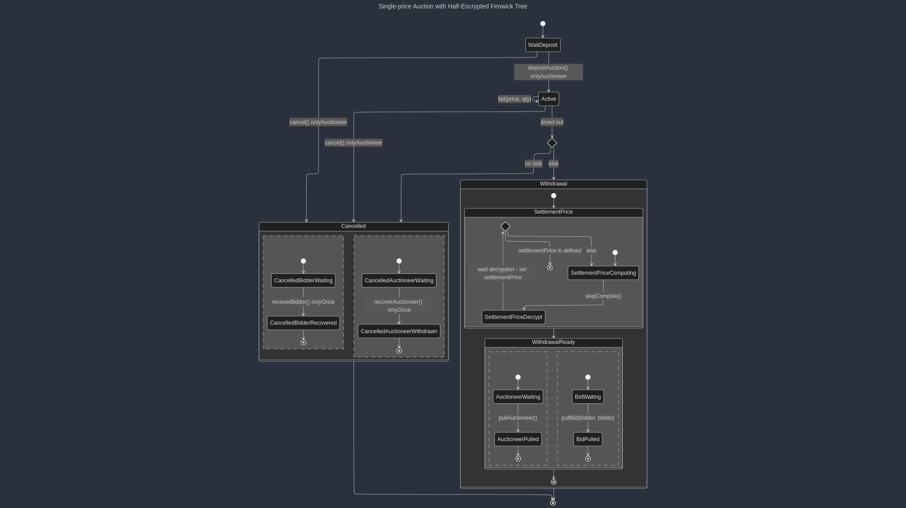
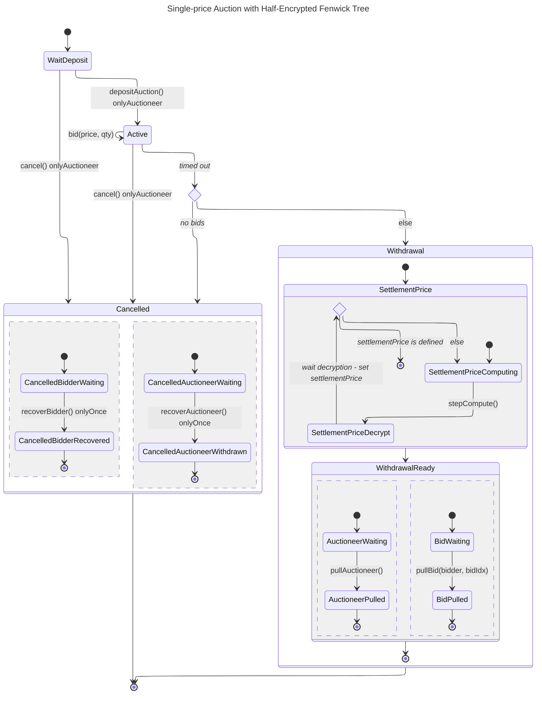

# Single-Price Auction State Diagram

### Source

```mermaid
---
title: Single-price Auction with Half-Encrypted Fenwick Tree
config:
  layout: elk
---
stateDiagram-v2
    [*] --> WaitDeposit

    WaitDeposit --> Active: depositAuction() onlyAuctioneer
    WaitDeposit --> Cancelled: cancel() onlyAuctioneer

    Active --> Active: bid(price, qty)
    Active --> Cancelled: cancel() onlyAuctioneer

    state CheckBidders <<choice>>

    CheckBidders --> Cancelled: _no bids_
    CheckBidders --> Withdrawal: else

    Active --> CheckBidders: _timed out_

    state Withdrawal {

      [*] -->  SettlementPrice
      state SettlementPrice {
        state SettlementPrice_IsFinished <<choice>>
        [*] --> SettlementPriceComputing
        SettlementPriceComputing --> SettlementPriceDecrypt: stepCompute()
        SettlementPriceDecrypt --> SettlementPrice_IsFinished: _wait decryption - set settlementPrice_
          SettlementPrice_IsFinished --> [*]: _settlementPrice is defined_
        SettlementPrice_IsFinished --> SettlementPriceComputing : _else_
      }
      SettlementPrice --> WithdrawalReady

      state WithdrawalReady {
        [*] --> AuctioneerWaiting
        AuctioneerWaiting --> AuctioneerPulled: pullAuctioneer()
        AuctioneerPulled --> [*]
        --
        [*] --> BidWaiting
        BidWaiting --> BidPulled: pullBid(bidder, bidIdx)
        BidPulled --> [*]
      }

      WithdrawalReady --> [*]
    }

    Withdrawal --> [*]

    state Cancelled {
        [*] --> CancelledAuctioneerWaiting
        CancelledAuctioneerWaiting --> CancelledAuctioneerWithdrawn: recoverAuctioneer() onlyOnce
        CancelledAuctioneerWithdrawn --> [*]
        --
        [*] --> CancelledBidderWaiting
        CancelledBidderWaiting --> CancelledBidderRecovered: recoverBidder() onlyOnce
        CancelledBidderRecovered --> [*]
    }

    Cancelled --> [*]
```
