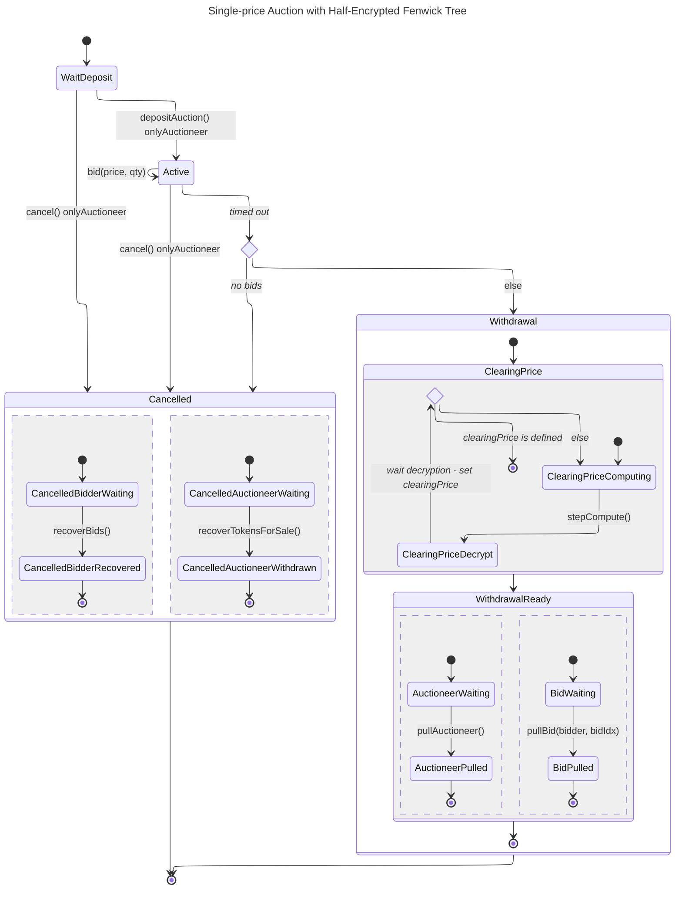

```mermaid
---
title: Single-price Auction with Half-Encrypted Fenwick Tree
config:
  layout: elk
---
stateDiagram-v2
    [*] --> WaitDeposit

    WaitDeposit --> Active: depositAuction() onlyAuctioneer
    WaitDeposit --> Cancelled: cancel() onlyAuctioneer

    Active --> Active: bid(price, qty)
    Active --> Cancelled: cancel() onlyAuctioneer

    state CheckBidders <<choice>>

    CheckBidders --> Cancelled: _no bids_
    CheckBidders --> Withdrawal: else

    Active --> CheckBidders: _timed out_

    state Withdrawal {

      [*] -->  ClearingPrice
      state ClearingPrice {
        state ClearingPrice_IsFinished <<choice>>
        [*] --> ClearingPriceComputing
        ClearingPriceComputing --> ClearingPriceDecrypt: stepCompute()
        ClearingPriceDecrypt --> ClearingPrice_IsFinished: _wait decryption - set clearingPrice_
          ClearingPrice_IsFinished --> [*]: _clearingPrice is defined_
        ClearingPrice_IsFinished --> ClearingPriceComputing : _else_
      }
      ClearingPrice --> WithdrawalReady

      state WithdrawalReady {
        [*] --> AuctioneerWaiting
        AuctioneerWaiting --> AuctioneerPulled: pullAuctioneer()
        AuctioneerPulled --> [*]
        --
        [*] --> BidWaiting
        BidWaiting --> BidPulled: pullBid(bidder, bidIdx)
        BidPulled --> [*]
      }

      WithdrawalReady --> [*]
    }

    Withdrawal --> [*]

    state Cancelled {
        [*] --> CancelledAuctioneerWaiting
        CancelledAuctioneerWaiting --> CancelledAuctioneerWithdrawn: recoverTokensForSale()
        CancelledAuctioneerWithdrawn --> [*]
        --
        [*] --> CancelledBidderWaiting
        CancelledBidderWaiting --> CancelledBidderRecovered: recoverBids()
        CancelledBidderRecovered --> [*]
    }

    Cancelled --> [*]
```
